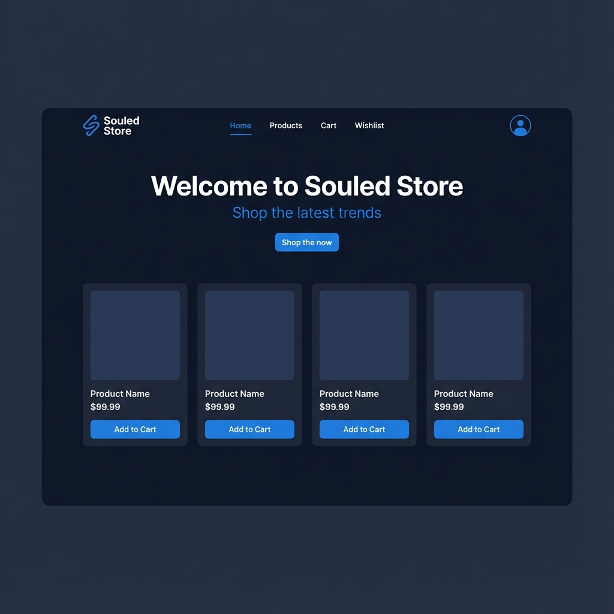
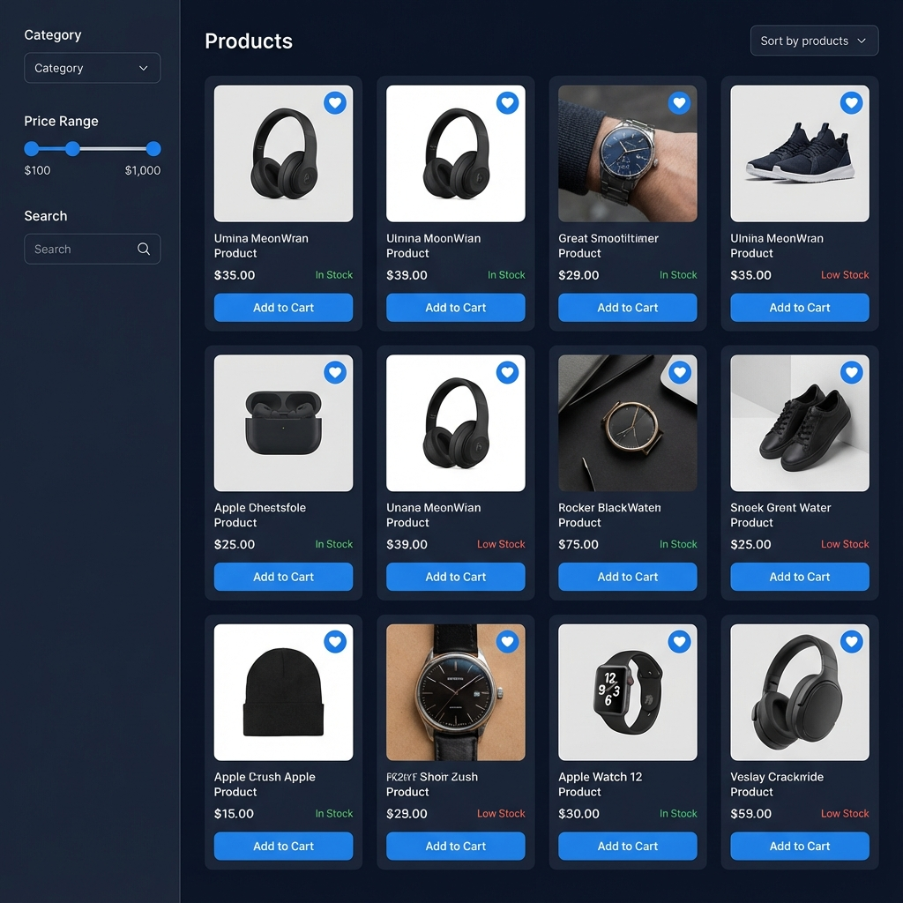
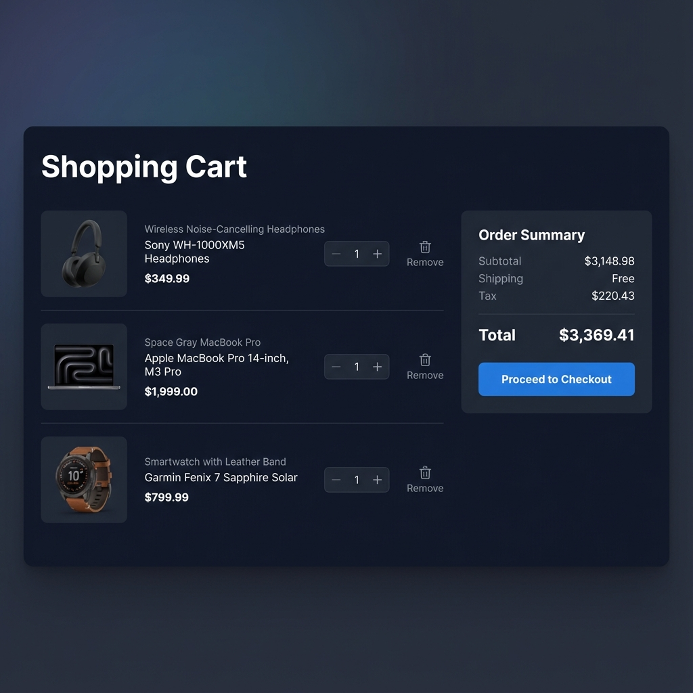
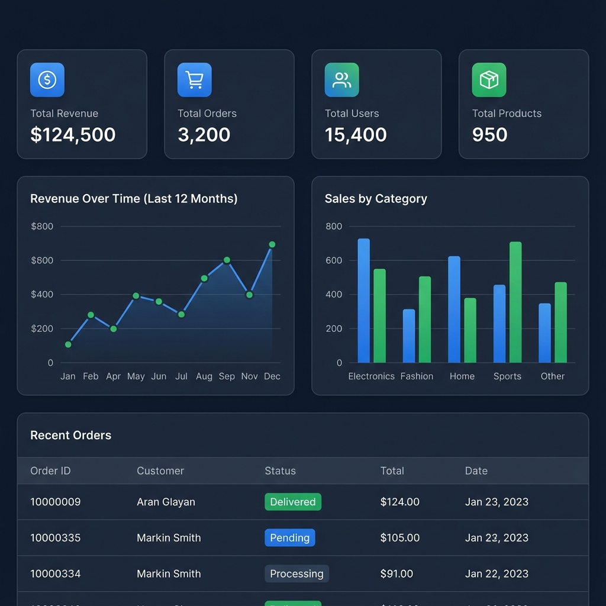

<div align="center">


### ✨ Lightning-fast shopping experience built with React & Vite

<p align="center">
  <a href="#-features"><kbd>Features</kbd></a>
  <a href="#-screenshots"><kbd>Screenshots</kbd></a>
  <a href="#-quick-start"><kbd>Quick Start</kbd></a>
  <a href="#-tech-stack"><kbd>Tech Stack</kbd></a>
  <a href="#-documentation"><kbd>Docs</kbd></a>
</p>

[](https://reactjs.org/)
[](https://vitejs.dev/)
[](https://tailwindcss.com/)
[](LICENSE)

</div>

<br/>

## ✨ Features

<table>
<tr>
<td width="50%">

### 🎨 Modern UI/UX

- ✅ Smooth animations with Framer Motion
- ✅ Fully responsive design
- ✅ Elegant dark theme
- ✅ Delightful micro-interactions
- ✅ Beautiful empty states

### 🛍️ Shopping Experience

- ✅ Advanced product filters
- ✅ Persistent shopping cart
- ✅ Wishlist functionality
- ✅ One-click actions
- ✅ Real-time stock updates

</td>
<td width="50%">

### 🔐 Authentication

- ✅ Email/Password login
- ✅ Google OAuth integration
- ✅ Protected routes
- ✅ Auto token refresh

### 💳 Checkout & Orders

- ✅ Multi-step checkout
- ✅ COD & Stripe payments
- ✅ Order tracking
- ✅ Payment verification
- ✅ Success animations

</td>
</tr>
</table>

### 👨‍💼 Admin Dashboard

> Full-featured admin panel with user management, product CRUD, order management, and analytics

<br/>

## 📸 Screenshots

<div align="center">

<table>
<tr>
<td colspan="2" align="center">
<h3>🖼️ Application Preview</h3>
</td>
</tr>
<tr>
<td width="50%">

<p align="center"><b>🏠 Home Page</b></p>
</td>
<td width="50%">

<p align="center"><b>🛍️ Products Listing</b></p>
</td>
</tr>
<tr>
<td width="50%">

<p align="center"><b>🛒 Shopping Cart</b></p>
</td>
<td width="50%">

<p align="center"><b>📊 Admin Dashboard</b></p>
</td>
</tr>
</table>

</div>

<br/>

## 🚀 Quick Start

### 📋 Prerequisites

```bash
Node.js 18+ (LTS recommended)
npm or yarn
Backend API running
```

### ⚡ Installation

```bash
# 1️⃣ Clone the repository
git clone <your-repo-url>
cd Souled

# 2️⃣ Install dependencies
npm install

# 3️⃣ Setup environment variables
cp .env.example .env
# Edit .env with your configuration

# 4️⃣ Start development server
npm run dev
```

> 🎉 **App running at** `http://localhost:5173`

### 🔧 Environment Variables

```env
VITE_API_URL=http://localhost:8000/api
VITE_GOOGLE_CLIENT_ID=your-google-client-id.apps.googleusercontent.com
```

📖 See [.env.example](./.env.example) for detailed setup instructions

<br/>

## 🛠️ Tech Stack

<div align="center">

### Core Technologies


### Styling & UI


### Features & Tools


</div>

<details>
<summary><b>📦 View All Dependencies</b></summary>

#### Core

- React 18.2.0 - UI library
- Vite 7.0.4 - Build tool & dev server
- React Router 7.7.0 - Client-side routing
- Zustand 5.0.9 - State management

#### Styling

- Tailwind CSS 4.1.11 - Utility-first CSS
- Framer Motion 12.23.12 - Animation library
- Lucide React - Icon library
- React Icons - Additional icons

#### Features

- Axios 1.10.0 - HTTP client
- React Toastify - Toast notifications
- React Confetti - Success celebrations
- Recharts 3.1.0 - Charts
- @react-oauth/google - Google OAuth

</details>

<br/>

## 📚 Documentation

<table>
<tr>
<td align="center" width="25%">
<a href="./API_DOCS.md">

<br/><b>API Docs</b>
</a>
<br/>Complete endpoint reference
</td>
<td align="center" width="25%">
<a href="./TESTING.md">

<br/><b>Testing Guide</b>
</a>
<br/>Setup & guidelines
</td>
<td align="center" width="25%">
<a href="./.env.example">

<br/><b>Environment</b>
</a>
<br/>Configuration guide
</td>
<td align="center" width="25%">
<a href="./DEPLOYMENT.md">

<br/><b>Deployment</b>
</a>
<br/>Deploy instructions
</td>
</tr>
</table>

<br/>

## 🧪 Testing

```bash
# Run tests
npm test

# Run with coverage
npm run test:coverage

# Run linter
npm run lint
```

📖 **Full testing guide:** [TESTING.md](./TESTING.md)

<br/>

## 📦 Build & Deployment

```bash
# Production build
npm run build

# Preview production build
npm run preview
```

🚀 **Deployment guide:** [DEPLOYMENT.md](./DEPLOYMENT.md)

<br/>

## 🤝 Contributing

Contributions are welcome! Feel free to open issues and pull requests.

<br/>

## 📄 License

This project is licensed under the MIT License.

<br/>

---

<div align="center">

### 💙 Built with passion by **JITHIN**

<p>
<a href="https://github.com/jithin-jz/souled-frontend">

</a>
<a href="https://github.com/jithin-jz/souled-frontend/fork">

</a>
</p>

**⭐ Star this repo if you find it helpful!**

<p>
<a href="https://github.com/jithin-jz/souled-frontend/issues">Report Bug</a>
·
<a href="https://github.com/jithin-jz/souled-frontend/issues">Request Feature</a>
</p>

<br/>


</div>
